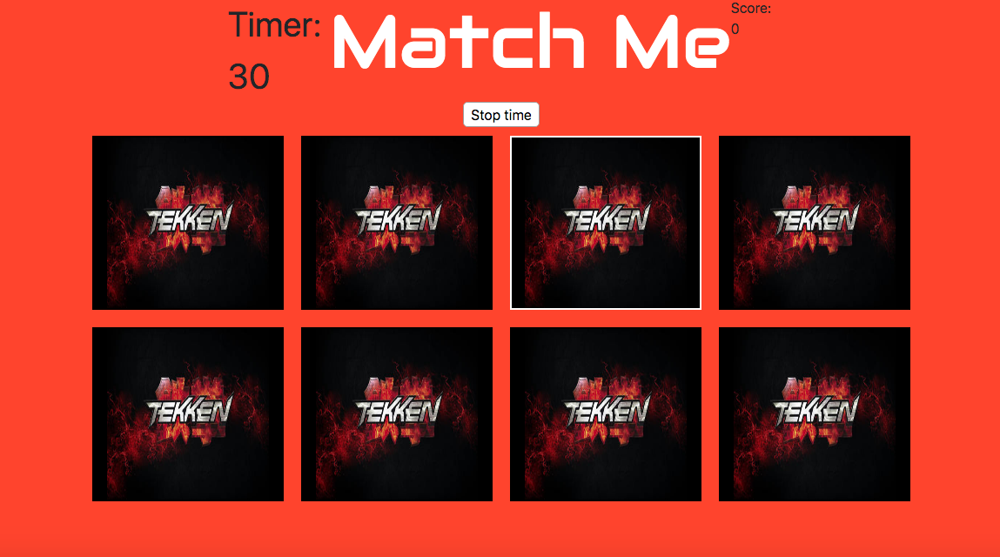

https://slack-files.com/T0351JZQ0-FJCFAKC2G-6d5d2b5508 

# Match Me Game Project
This is a game to enhance concentration and short term memory. Match memory games are generally used as a way to train your brain. Memory enhancing games like match can be played daily for optimal results.

//Player clicks on card
//Card flips over to show image
//Timer will start once player starts game
//If player matches image to other image, before timer runs out, player gains points
//If player finds all matches of game before timer
show "win"
else "lose"

Technologies Used:
HTML
CSS
Javascript
Bootstrap

Getting Started :
https://bedforda.github.io/Project-One/

Instructions: 
Turn over any two cards.
If two cards match, you have a set! 
The game is over when all the cards have been matched.

Next Steps: 
Future enhancements for the game is to make it an educational memory game where when a matching set is made, an important educational fact will prompt relevant to the matching set. 

